<!--
SPDX-FileCopyrightText: 2024-2026 Pagefault Games

SPDX-License-Identifier: CC-BY-NC-SA-4.0
-->

<picture></picture>

 \

PokéRogue is a browser based Pokémon fangame heavily inspired by the roguelite genre. Battle endlessly while gathering stacking items, exploring many different biomes, fighting trainers, bosses, and more!

# Android version

This community fork adds an offline Android app with two launchers: **PokéRogue**
for solo play and **PokéRogue 2Players** for local play on one phone.
Download the latest APK from the [Android releases page](https://github.com/doctormajid7-ux/pokerogue-2P-splitscreen/releases).

## Android features

- Play solo offline, with the game and its resources included in the app.
- Adjust the solo screen for portrait or landscape, pinch to zoom, and move the
  touch controls. The control layout is saved separately for each orientation.
- Play split-screen with two people sharing one phone. Each player has their own
  screen half, touch controls, profile, save data, and game language. The upper
  screen is rotated for the player sitting opposite.
- Choose from three two-player modes:
  - **Free Duo:** progress independently against the AI, with the option to play
    scored duels against each other.
  - **Block Match:** progress against the AI and duel after each block of
    battles.
  - **Random Quick Battle:** start immediately with computer-generated teams.
    Pick fully random teams at a shared random level, or balanced teams at a
    chosen or random level.
- Continue a two-player profile's progress in solo mode, including captured
  Pokémon.
- Two-player duels use the game's regular animated battle scenes. One background
  music track plays while sound effects from both battles remain active.
- The solo profile picker and all two-player shell menus, messages, and result
  screens are translated into all 24 game languages. They follow the last solo
  profile's language by default; the
  two-player setup also has a dropdown to choose another shared shell language.
  Pause and quit controls use that same language. Background music is encoded at
  32 kbit/s or lower to reduce app size.

For installation and gameplay details, read the [Android player guide](./android/README.md)
in English or [French](./android/README.fr.md). Changes from the original browser
game are listed in the [Android changelog](./android/CHANGELOG.md).

## Android screenshots

These screenshots show the Android controls, solo battles, and local two-player
mode. Select any image to view it at full size.

### Solo play

<table>
  <tr>
    <td align="center"><a href="./docs/screenshots/Screenshot_20260929_200926.jpg">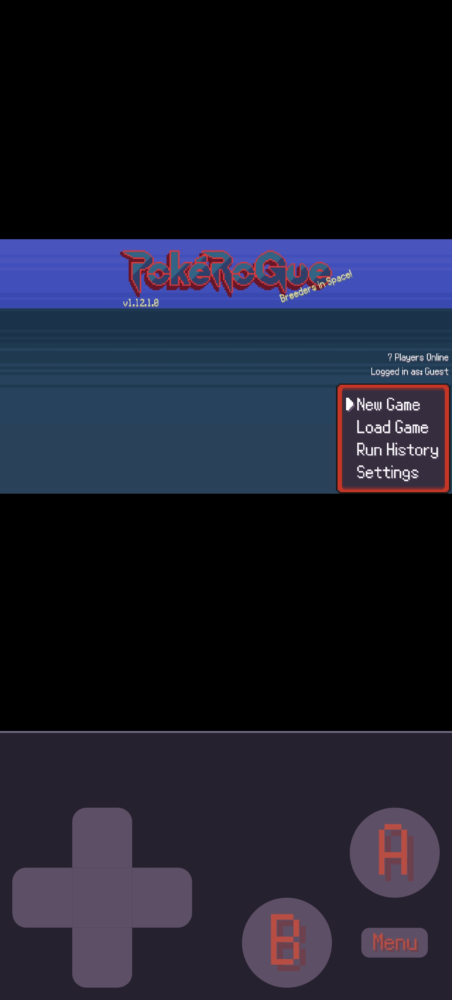</a> Main menu and touch controls</td>
    <td align="center"><a href="./docs/screenshots/Screenshot_20260929_200936.jpg">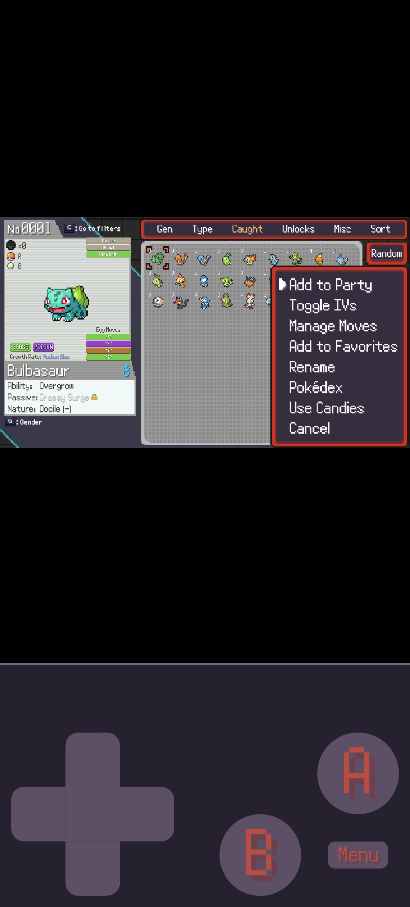</a> Pokémon selection</td>
    <td align="center"><a href="./docs/screenshots/Screenshot_20260929_201027.jpg">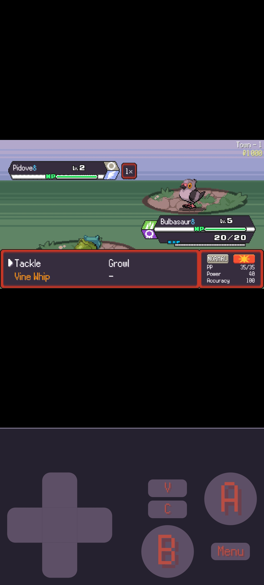</a> Solo battle move menu</td>
    <td align="center"><a href="./docs/screenshots/Screenshot_20260929_213920.jpg">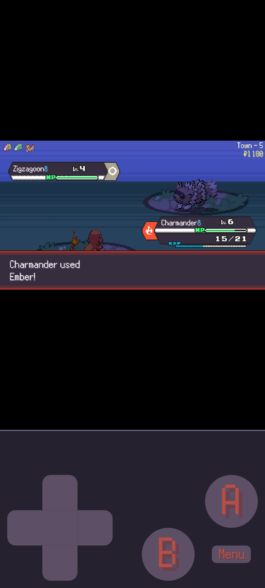</a> Battle messages and effects</td>
  </tr>
  <tr>
    <td align="center"><a href="./docs/screenshots/Screenshot_20260929_213926.jpg">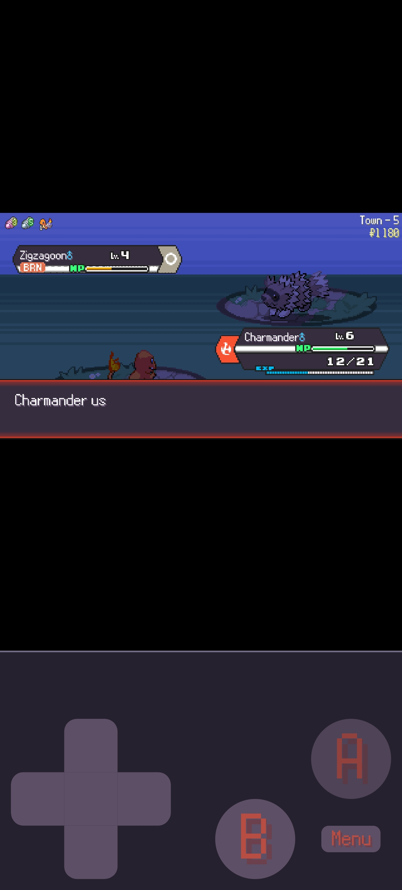</a> Attack feedback</td>
    <td align="center"><a href="./docs/screenshots/Screenshot_20260929_214624.jpg">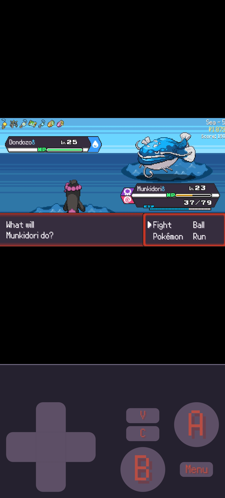</a> Battle later in a run</td>
    <td align="center"><a href="./docs/screenshots/Screenshot_20260929_215002.jpg">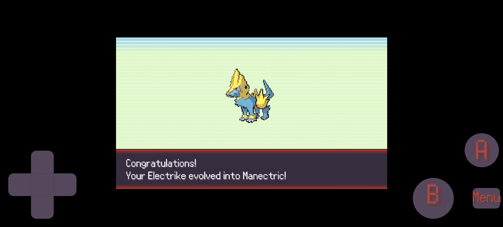</a> Evolution in landscape orientation</td>
  </tr>
</table>

### Local two-player mode

<table>
  <tr>
    <td align="center"><a href="./docs/screenshots/Screenshot_20260929_201320.jpg">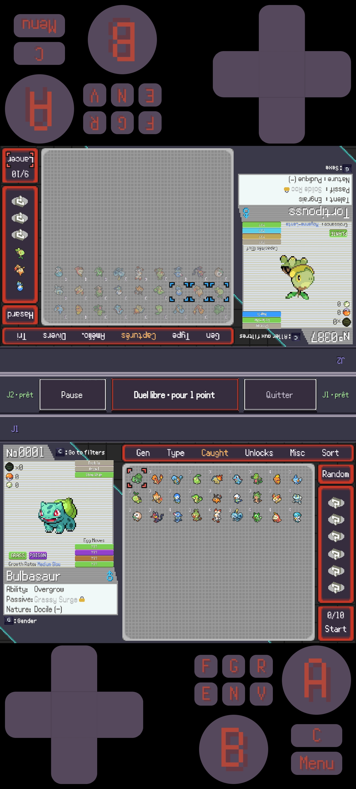</a> Split-screen team selection</td>
    <td align="center"><a href="./docs/screenshots/Screenshot_20260929_201353.jpg">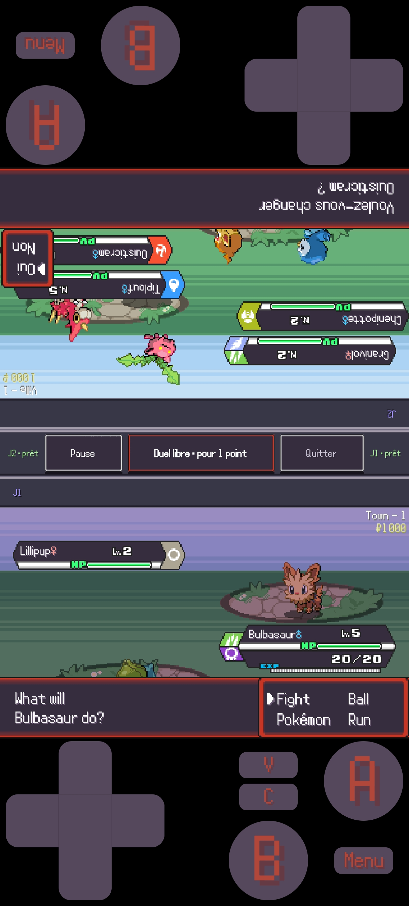</a> Local split-screen battle</td>
    <td align="center"><a href="./docs/screenshots/Screenshot_20260929_201521.jpg">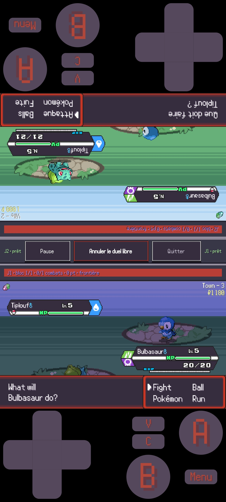</a> Free duel between players</td>
    <td align="center"><a href="./docs/screenshots/Screenshot_20260929_212200.jpg">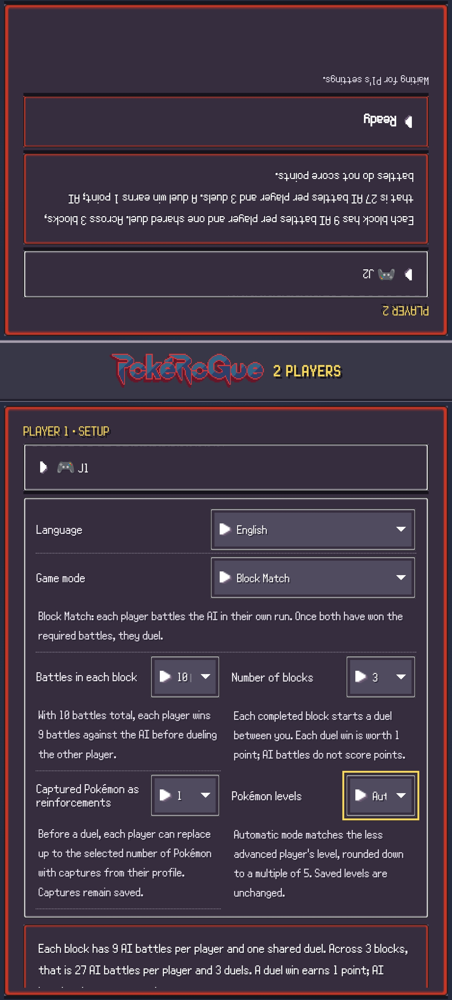</a> Two-player mode setup</td>
  </tr>
</table>

## Original PokéRogue project

PokéRogue is the original browser game created by Pagefault Games. Visit the
[original game website](https://pokerogue.net/) or the [Pagefault Games GitHub page](https://github.com/pagefaultgames).
Browse the [original source repository](https://github.com/pagefaultgames/pokerogue).

# Contributing

See [CONTRIBUTING.md](./CONTRIBUTING.md), this includes instructions on how to set up the game locally.

# 📝 Credits

> If this project contains assets you have produced and you do not see your name, **please** reach out, either [here on GitHub](https://github.com/pagefaultgames/pokerogue/issues/new) or via [Discord](https://discord.gg/pokerogue).

Thank you to all the wonderful people that have contributed to the PokéRogue project! You can find the credits [here](./CREDITS.md).

# Licensing

This repository seeks to be [REUSE compliant](https://reuse.software/): copyright and/or licensing information for each file is stored
either in the file itself or in an associated `REUSE.toml` file.

The full licensing information for each file can be found by utilizing [REUSE's tooling](https://github.com/fsfe/reuse-tool), such as via `reuse spdx`. \
An abbreviated summary of said information is as follows:
- All source code belonging to the project, unless otherwise noted, is licensed under [AGPL-v3.0-only](LICENSES/AGPL-3.0-only.txt).
- All forms of documentation (both Markdown files[^1] and any comments explicitly documenting source code) are licensed under [CC-BY-NC-SA-4.0](LICENSES/CC-BY-NC-SA-4.0.txt).
- Auto-generated files produced by external tools or files of insignificant originality are not copyrighted and are licensed under [CC0-1.0](LICENSES/CC0-1.0.txt).
- To the extent that the assets we provide are [licensable and applicable](https://creativecommons.org/licenses/by-nc-sa/4.0/deed.en#ref-exception-or-limitation), they are licensed under [CC-BY-NC-SA-4.0](LICENSES/CC-BY-NC-SA-4.0.txt) unless otherwise noted.
  Exceptions can be found in associated `REUSE.toml` files.
  - ⚠️ Files in `assets/` that are not explicitly licensed via `REUSE.toml` files should be considered to have _no_ licensing / copyright information.

[^1]: Including this README
